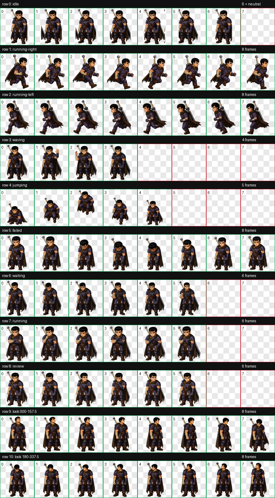

# Питомец «Гатс» для Codex

> Компактный анимированный спутник Гатс для десктопного Codex: тёмная броня, суровый взгляд и Dragonslayer за спиной.

<p align="center">
  
</p>

<p align="center">
  <a href="README.md">English version</a>
</p>

## Что внутри

- Готовый к установке кастомный питомец с именем `Гатс`.
- Спрайт-лист v2: 8 × 11 ячеек, `1536 × 2288` пикселей.
- Idle, бег в обе стороны, приветствие, прыжок, реакция на ошибку, ожидание, работа и review.
- Шестнадцать направлений взгляда для плавного полного круга.

## Установка

1. Закройте или обновите список питомцев в Codex.
2. Скопируйте `pet.json` и `spritesheet.webp` в папку:

   ```text
   %USERPROFILE%\.codex\pets\guts\
   ```

3. Откройте Codex, затем выберите **Settings → Pets** и питомца `Гатс`.

Если папка с таким ID уже есть, сначала сделайте её резервную копию.

## Структура пакета

```text
.
├── assets/
│   └── preview.png
├── pet.json
└── spritesheet.webp
```

В `pet.json` указан `spriteVersionNumber: 2`. Этот файл должен лежать рядом со спрайт-листом, иначе Codex не загрузит расширенный набор анимаций.

## Проверка

В репозиторий добавлен тот же финальный файл, который прошёл локальную проверку для Codex:

- WebP-атлас `1536 × 2288`;
- RGBA-прозрачность без непрозрачных пикселей хромакея;
- все обязательные ячейки v2 заполнены, неиспользуемые — прозрачны.

## Примечание

Это неофициальный некоммерческий фанатский питомец. **Berserk**, Гатс и Dragonslayer связаны с Кэнтаро Миурой и соответствующими правообладателями. Репозиторий не аффилирован и не одобрен ими.
